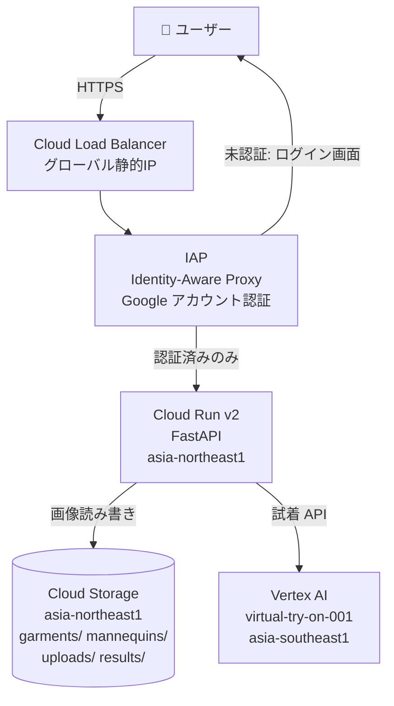
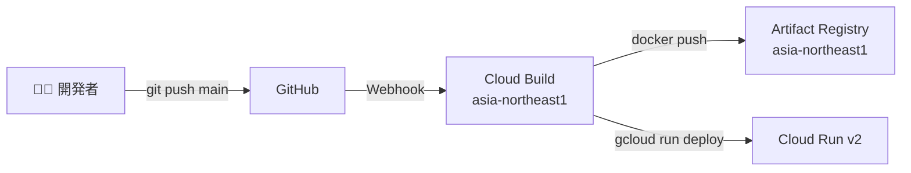

# Virtual Try-On 設計資料

## 1. システム概要

Vertex AI の `virtual-try-on-001` モデルを使い、人物画像と衣服画像からバーチャル試着結果を生成する API および Web UI。

- **バックエンド**: FastAPI（Cloud Run）
- **ストレージ**: Cloud Storage（衣服・人物・結果画像）
- **AI モデル**: Vertex AI `virtual-try-on-001`（試着）/ `imagen-3.0-generate-001`（サンプル画像生成）
- **CI/CD**: Cloud Build（main ブランチ push → 自動デプロイ）

---

## 2. アーキテクチャ

### リクエストフロー



### CI/CD フロー



---

## 3. 有効化が必要な GCP API

```bash
gcloud services enable \
  aiplatform.googleapis.com \
  run.googleapis.com \
  artifactregistry.googleapis.com \
  cloudbuild.googleapis.com \
  storage.googleapis.com \
  compute.googleapis.com \
  iap.googleapis.com
```

| API | 用途 |
|-----|------|
| `aiplatform.googleapis.com` | Vertex AI (Virtual Try-On / Imagen) |
| `run.googleapis.com` | Cloud Run |
| `artifactregistry.googleapis.com` | Docker イメージ管理 |
| `cloudbuild.googleapis.com` | CI/CD パイプライン |
| `storage.googleapis.com` | GCS |
| `compute.googleapis.com` | Cloud Load Balancing |
| `iap.googleapis.com` | Identity-Aware Proxy |

---

## 4. IAM 権限

### 4-1. ローカル開発（ユーザーアカウント）

```bash
gcloud auth application-default login
```

| ロール | 用途 |
|--------|------|
| `roles/aiplatform.user` | Vertex AI API 呼び出し |
| `roles/storage.objectAdmin` | GCS 読み書き |

### 4-2. Cloud Run サービスアカウント（Terraform が自動作成）

アカウント名: `virtual-try-on-run-sa@PROJECT.iam.gserviceaccount.com`

| ロール | 用途 |
|--------|------|
| `roles/aiplatform.user` | Vertex AI API 呼び出し |
| `roles/storage.objectAdmin` | GCS 読み書き |

### 4-3. Cloud Build サービスアカウント（Terraform が自動作成）

アカウント名: `virtual-try-on-cb-sa@PROJECT.iam.gserviceaccount.com`

| ロール | 用途 |
|--------|------|
| `roles/run.admin` | Cloud Run デプロイ |
| `roles/artifactregistry.writer` | Docker イメージ push |
| `roles/logging.logWriter` | ビルドログ書き込み |
| `roles/iam.serviceAccountUser` | Cloud Run SA として動作 |

---

## 5. 環境変数

### アプリケーション（Cloud Run / ローカル）

| 変数名 | 必須 | デフォルト | 説明 |
|--------|------|-----------|------|
| `GCP_PROJECT` | ✓ | — | GCP プロジェクト ID |
| `GCS_BUCKET` | ✓ | — | GCS バケット名 |
| `GCP_REGION` | | `asia-northeast1` | Cloud Run のリージョン |
| `VERTEX_AI_REGION` | | `asia-southeast1` | Vertex AI API のリージョン |
| `GCS_GARMENTS_PREFIX` | | `garments/` | 衣服画像の GCS プレフィックス |
| `GCS_MANNEQUINS_PREFIX` | | `mannequins/` | マネキン画像の GCS プレフィックス |
| `GCS_UPLOADS_PREFIX` | | `uploads/` | アップロード先プレフィックス |
| `GCS_RESULTS_PREFIX` | | `results/` | 試着結果の保存先プレフィックス |

### ローカル開発（`.envrc`）

```bash
use flake

export GCP_PROJECT=your-project-id
export GCS_BUCKET=your-bucket-name
export GCP_REGION=asia-northeast1
export VERTEX_AI_REGION=asia-southeast1
```

### Terraform (`terraform/terraform.tfvars`)

```hcl
project_id       = "your-project-id"
region           = "asia-northeast1"
vertex_ai_region = "asia-southeast1"
gcs_bucket       = "your-bucket-name"
github_owner     = "your-github-username"
github_repo      = "virtual-try-on-sample"
```

---

## 6. GCS バケット構成

```
gs://BUCKET_NAME/
├── garments/
│   ├── tops/               ← トップス・ジャストサイズ（Tシャツ・ブラウス・カーディガン等）
│   │   ├── tight/          ← タイト（スリム）バリアント
│   │   ├── oversized/      ← オーバーサイズバリアント
│   │   ├── relaxed/        ← ゆったりバリアント
│   │   └── box/            ← ボックスシルエットバリアント
│   └── bottoms/            ← ボトムス・ジャストサイズ（パンツ・スカート等）
│       ├── tight/
│       ├── oversized/
│       ├── relaxed/
│       └── box/
├── mannequins/             ← マネキン画像（男性・女性）
├── uploads/                ← ユーザーがアップロードした人物画像（自動生成）
└── results/                ← 試着結果画像（自動生成）
```

フィットなし（`garments/tops/white-tshirt.png`）がジャストサイズ扱いとなり、後方互換性を保つ。フィットバリアントは `task generate-fit-variants` で生成。

バケット作成:

```bash
gcloud storage buckets create gs://BUCKET_NAME --location=asia-northeast1
```

---

## 7. リージョン選定の理由

| リソース | リージョン | 理由 |
|---------|-----------|------|
| Cloud Run | `asia-northeast1`（東京）| エンドユーザーへの低レイテンシ |
| Artifact Registry | `asia-northeast1`（東京）| Cloud Run と同一リージョン |
| GCS バケット | `asia-northeast1`（東京）| Cloud Run と同一リージョンでの高速アクセス |
| Vertex AI | `asia-southeast1`（シンガポール）| `virtual-try-on-001` / `imagen-3.0-generate-001` が `asia-northeast1` 未対応 |

---

## 8. 社内限定アクセス制御（IAP）

### 概要

Cloud Load Balancer の前段に **Identity-Aware Proxy (IAP)** を設置することで、社員の Google アカウントで認証されたユーザーのみアクセスを許可する。アプリ側のコード変更は不要。

```
ブラウザ
  │
  ▼ HTTPS (カスタムドメイン)
Cloud Load Balancer
  │
  ▼ IAP（Google アカウント認証）
  │  → 未認証: Google ログイン画面にリダイレクト
  │  → 認証済み・権限なし: 403 Forbidden
  │  → 認証済み・権限あり: ↓
  ▼
Cloud Run (ingress = INTERNAL_LOAD_BALANCER)
  ※ 直接 URL（*.run.app）へのアクセスは ingress 制限で遮断
```

### アクセス制御の仕組み

| レイヤー | 制御内容 |
|---------|---------|
| Cloud Run ingress | `INTERNAL_LOAD_BALANCER` — LB 以外からの直接アクセスを遮断 |
| IAP | Google アカウント認証 + `iap_members` 変数に指定したユーザー/グループ/ドメインのみ許可 |

### terraform.tfvars に追加が必要な変数

```hcl
domain                   = "tryon.company.com"
iap_oauth2_client_id     = "xxxxx.apps.googleusercontent.com"
iap_oauth2_client_secret = "GOCSPX-xxxxxx"
iap_members              = ["domain:company.com"]      # 社員全員を許可する場合
# iap_members            = ["group:dev@company.com"]   # 特定グループのみの場合
# iap_members            = ["user:alice@company.com"]  # 特定ユーザーのみの場合
```

### セットアップ手順（IAP 有効化）

```
1. GCP API 有効化
   └─ gcloud services enable \
        compute.googleapis.com \
        iap.googleapis.com \
        artifactregistry.googleapis.com \
        run.googleapis.com \
        cloudbuild.googleapis.com \
        aiplatform.googleapis.com \
        storage.googleapis.com

2. OAuth 同意画面を設定（コンソールで手動）
   └─ GCP コンソール → APIs & Services → OAuth 同意画面
      → ユーザーの種類: 「内部」（Google Workspace 組織内のみ）を選択
      → アプリ名・サポートメールを入力して保存

3. OAuth クライアント ID を作成（コンソールで手動）
   └─ GCP コンソール → APIs & Services → 認証情報
      → 認証情報を作成 → OAuth クライアント ID
      → アプリケーションの種類: 「ウェブ アプリケーション」
      → 名前: "Virtual Try-On IAP"
      → 作成後に表示される「クライアント ID」と「クライアントシークレット」を控える
   ※ google_iap_brand / google_iap_client は 2025年7月以降廃止のため Terraform 管理外

4. terraform.tfvars に変数を追加
   └─ domain / iap_oauth2_client_id / iap_oauth2_client_secret / iap_members を設定

5. terraform apply
   ├─ LB・NEG・Backend Service・IAP が作成される
   └─ terraform output lb_ip で IP アドレスを確認

6. OAuth クライアントの承認済み URI を設定（コンソールで手動）
   └─ 手順 3 で作成した OAuth クライアント ID を編集
      → 承認済みの JavaScript 生成元 に以下を追加:
         https://{domain}
      → 承認済みのリダイレクト URI に以下を追加:
         https://iap.googleapis.com/v1/oauth/clientIds/{CLIENT_ID}:handleRedirect

7. DNS 設定（どちらか選択）
   ├─ [Option A] sslip.io を使う場合（DNS 変更不要）
   │     terraform.tfvars の domain を "<lb_ip>.sslip.io" に変更して再 apply
   └─ [Option B] カスタムドメインの場合
         DNS の A レコードに lb_ip を登録

8. SSL 証明書のプロビジョニングを待つ（最大 60 分）
   └─ 確認: gcloud compute ssl-certificates describe virtual-try-on-cert \
               --global --format="value(managed.status)"
      "ACTIVE" になれば完了

9. ブラウザで https://{domain} にアクセスして Google ログイン画面が表示されることを確認
```

---

## 9. デプロイフロー

### 初回セットアップ

```
1. GCP API 有効化
   └─ gcloud services enable ...

2. GCS バケット作成
   └─ gcloud storage buckets create gs://BUCKET --location=asia-northeast1

3. Cloud Build の GitHub App 連携（コンソールで手動）
   └─ https://console.cloud.google.com/cloud-build/triggers
      → リポジトリを接続 → GitHub (Cloud Build GitHub App)

4. Terraform でインフラ構築
   └─ task tf-init && task tf-apply
      作成リソース:
        - Artifact Registry リポジトリ
        - Cloud Run サービスアカウント + IAM
        - Cloud Build サービスアカウント + IAM
        - Cloud Run サービス（初回はプレースホルダー）
        - Cloud Build トリガー（main push で発火）

5. サンプル画像の生成・アップロード
   └─ task generate-garments   # 衣服画像
   └─ task generate-mannequins # マネキン画像

6. 初回デプロイ
   └─ git push origin main
      Cloud Build が自動実行され Cloud Run に反映
```

### 以降のデプロイ

```
git push origin main  →  Cloud Build  →  Cloud Run（自動）
```

---

## 10. Vertex AI Virtual Try-On API 仕様

### 使用 SDK

`google-genai` SDK（Vertex AI モード）を使用。`google-cloud-aiplatform` や REST 直叩きは使っていない。

```python
from google import genai
from google.genai import types

with genai.Client(vertexai=True, project=PROJECT, location=REGION) as client:
    response = client.models.recontext_image(
        model="virtual-try-on-001",
        source=types.RecontextImageSource(
            person_image=types.Image(image_bytes=person_bytes),
            product_images=[
                types.ProductImage(product_image=types.Image(image_bytes=garment_bytes))
            ],
        ),
        config=types.RecontextImageConfig(number_of_images=1),
    )
result_bytes = response.generated_images[0].image.image_bytes
```

**対応リージョン**: `asia-southeast1`（シンガポール）のみ確認済み。`asia-northeast1`（東京）は未対応。

### API の制約・挙動

| 制約 | 内容 |
|------|------|
| **1 呼び出しあたりの衣服数** | `productImages` に指定できるのは **1 枚のみ**（2 枚以上は 400 エラー） |
| **衣服の除去** | API は person 画像に写っている既存の衣服を内部で除去した上で指定衣服を適用する |
| **衣服カテゴリ指定** | トップス・ボトムスの区別を API に明示する手段はない（モデルが自動判定） |
| **画像フォーマット** | PNG / JPEG 対応、base64 エンコードで送受信 |
| **タイムアウト** | 1 衣服あたり最大約 60 秒。`HttpOptions.timeout` の単位は**ミリ秒**（`180000` = 180 秒に設定） |

---

## 11. チェーン試着の設計

### 課題

Virtual Try-On API は **1 呼び出しにつき衣服 1 枚** しか指定できない。トップスとボトムスを同時に試着させることができない。

### 解決策：サーバーサイドチェーン

トップスとボトムスの両方が指定された場合、サーバー側で 2 回 API を連続呼び出しする。

```
原人物画像
    │
    ▼ API 呼び出し①（ボトムス）
ボトムス試着済み画像
    │
    ▼ API 呼び出し②（トップス）
ボトムス＋トップス試着済み画像（最終結果）
```

**順序の理由**: トップスを後から適用すると API が上半身を処理する際にボトムスが残りやすい。先にボトムスを適用してからトップスを重ねることでトップスの消失を防ぐ。

実装箇所: `app/services/vertex_ai.py` の `run_virtual_tryon()`

```python
def run_virtual_tryon(person_bytes, top_bytes, bottom_bytes) -> bytes:
    result = person_bytes
    if bottom_bytes:
        result = _call_tryon(result, bottom_bytes) # ① ボトムスを先に適用
    if top_bytes:
        result = _call_tryon(result, top_bytes)    # ② その結果にトップスを適用
    return result
```

### 重要な発見：試着結果を人物画像に再利用できない

試着結果（result 画像）を次の API 呼び出しの person 画像として使用すると、**先に適用した衣服が消える**。

**原因**: API は入力された person 画像から衣服を除去してから新しい衣服を適用する設計のため、試着結果画像を person として渡しても、前の衣服が「上書き除去」される。

**対応方針**: フロントエンドは常に **元の人物画像 URI（`originalPersonGcsUri`）** をベースとし、現在選択中のすべての衣服を一括で API に送る。試着結果の GCS URI を次の呼び出しの person に使わない。

```
【NG】試着結果を person に再利用
  original → API(top) → result1(GCS) → API(bottom) → result2
                                ↑ここでトップスが消える

【OK】毎回 original から出発してチェーン
  original → API(top) → in-memory bytes → API(bottom) → result2
             ←────────── run_virtual_tryon() の内部処理 ──────────→
```

### フロントエンドの状態管理

| 変数 | 説明 |
|------|------|
| `originalPersonGcsUri` | 選択した人物画像の GCS URI（変更されない） |
| `selectedTop` | 現在選択中のトップス `{gcsUri, label, baseName, fit, fits}` |
| `selectedBottom` | 現在選択中のボトムス `{gcsUri, label, baseName, fit, fits}` |
| `selectedTopFit` | トップスの現在選択シルエット（`just` / `tight` / `oversized` / `relaxed` / `box`） |
| `selectedBottomFit` | ボトムスの現在選択シルエット |
| `topFitSelections` | `{fit: entry}` — フィット別のトップス選択履歴 |
| `bottomFitSelections` | `{fit: entry}` — フィット別のボトムス選択履歴 |
| `topsGroups` | `{baseName: {fit: item}}` — 初回ロード時に全量取得したトップスデータ |
| `bottomsGroups` | `{baseName: {fit: item}}` — 初回ロード時に全量取得したボトムスデータ |

衣服カードを選択するたびに `selectedTop` / `selectedBottom` と `topFitSelections[fit]` / `bottomFitSelections[fit]` が更新され、`/api/tryon` に `originalPersonGcsUri` + 現在選択中の全衣服を送信する。

### ユーザー操作フロー

```
① 人物を選択（マネキン or アップロード）
        │
② シルエットボタンで衣服グリッドの表示を切り替え（API 呼び出しなし）
        │  ├─ フィット変更時は対象カテゴリの画像のみ切り替え（tops / bottoms 独立）
        │  └─ 前回そのフィットで選択済みの衣服があれば選択状態を復元（試着は走らない）
        │
③ 衣服カードをクリック（自動試着トリガー）
        │
        ├─ トップスのみ選択 → API①のみ実行
        ├─ ボトムスのみ選択 → API①のみ実行
        └─ 両方選択済みの場合 → API①②を連続実行（最大2分）
        │
④ 試着結果表示（試着前 / 試着後 の横並び比較）
        │
⑤ 別の衣服 / シルエットを選択 → ③に戻る
        │
⑥ リセットボタン → 選択クリア・シルエットをジャストにリセット、元の人物画像に戻る
```

### 既知の制限

| 制限 | 説明 |
|------|------|
| **上着のみ試着すると下半身が素体に見える** | API が person 画像の衣服を除去して上着のみ適用するため。ボトムスも合わせて選択することで解消する。 |
| **ジャケット着用時にインナーが消える** | API は上半身の衣服をすべて除去してから指定衣服を適用する設計のため、インナーとアウターを区別できない。`categories_to_replace` パラメータを試みたが API 未サポートであることを確認済み。回避策なし（API 仕様上の制限）。 |
| **同種の衣服を重ねられない** | トップスは 1 枚のみ有効。新しいトップスを選ぶと前のトップスは置き換わる。 |
| **試着順序は固定** | 必ずボトムス→トップスの順で適用される（トップス消失防止のため）。 |

---

## 12. API エンドポイント仕様（FastAPI）

### GET /health

ヘルスチェック。

**Response**
```json
{"status": "ok"}
```

---

### GET /api/garments

GCS の `garments/` 配下の衣服一覧を返す。

**Query Parameters**

| パラメータ | 型 | 説明 |
|-----------|-----|------|
| `category` | string（任意）| `tops` または `bottoms` で絞り込み |

**Response**
```json
[
  {
    "name": "tops/white-tshirt.png",
    "gcs_uri": "gs://bucket/garments/tops/white-tshirt.png",
    "image_url": "/api/image?uri=gs%3A%2F%2F...",
    "fit": "just",
    "base_name": "white-tshirt",
    "category": "tops"
  },
  {
    "name": "tops/tight/white-tshirt.png",
    "gcs_uri": "gs://bucket/garments/tops/tight/white-tshirt.png",
    "image_url": "/api/image?uri=gs%3A%2F%2F...",
    "fit": "tight",
    "base_name": "white-tshirt",
    "category": "tops"
  }
]
```

フロントエンドは `base_name` でグルーピングし `{fit: item}` 辞書を構築。シルエット切り替え時は `` を差し替えるだけで API 呼び出しは不要。

---

### GET /api/mannequins

GCS の `mannequins/` 配下のマネキン画像一覧を返す。

**Response**
```json
[
  {
    "name": "male-1.png",
    "gcs_uri": "gs://bucket/mannequins/male-1.png",
    "image_url": "/api/image?uri=gs%3A%2F%2F...",
    "gender": "male"
  }
]
```

`gender` はファイル名先頭が `female` なら `"female"`、それ以外は `"male"`。

---

### POST /api/upload

人物画像をアップロードし GCS に保存する。

**Request** `multipart/form-data`

| フィールド | 型 | 説明 |
|-----------|-----|------|
| `file` | File | JPEG または PNG 画像 |

**Response**
```json
{
  "gcs_uri": "gs://bucket/uploads/uuid.jpg",
  "image_url": "/api/image?uri=gs%3A%2F%2F..."
}
```

---

### POST /api/tryon

Virtual Try-On API を呼び出し、試着結果を返す。

**Request** `application/json`

```json
{
  "person_gcs_uri": "gs://bucket/mannequins/male-1.png",
  "top_gcs_uri": "gs://bucket/garments/tops/white-tshirt.png",
  "bottom_gcs_uri": "gs://bucket/garments/bottoms/blue-jeans.png"
}
```

| フィールド | 必須 | 説明 |
|-----------|------|------|
| `person_gcs_uri` | ✓ | 人物画像の GCS URI |
| `top_gcs_uri` | △ | トップス画像の GCS URI（`top_gcs_uri` か `bottom_gcs_uri` のどちらかは必須） |
| `bottom_gcs_uri` | △ | ボトムス画像の GCS URI |

両方指定された場合はサーバーサイドでチェーン実行（ボトムス→トップスの順）。

**Response**
```json
{
  "result_url": "/api/image?uri=gs%3A%2F%2F...",
  "result_gcs_uri": "gs://bucket/results/uuid.png"
}
```

**エラーレスポンス**

| ステータス | 説明 |
|-----------|------|
| `400` | GCS から画像を取得できない、またはリクエストパラメータ不正 |
| `502` | Vertex AI API エラー |

---

### GET /api/image

GCS オブジェクトをプロキシ配信する。

Signed URL の代わりにこのエンドポイントを使う。Application Default Credentials（ADC）はユーザー認証情報を使うため署名付き URL の生成に必要な秘密鍵を持たない。Cloud Run 上でも同様にサービスアカウントの鍵ファイルなしで動作させるためプロキシ方式を採用。

**Query Parameters**

| パラメータ | 説明 |
|-----------|------|
| `uri` | `gs://` 形式の GCS URI |

**Response** 画像バイナリ（`image/jpeg` または `image/png`）

`Cache-Control: public, max-age=86400, immutable` ヘッダーを付与。衣服・マネキン画像はブラウザに 24 時間キャッシュされるため、シルエット切り替え時の再フェッチが不要になる。

---

## 13. シルエット（フィット）機能

### 概要

衣服に 5 種類のシルエット属性を持たせ、ユーザーが試着前にシルエットを選択できる。

| フィットキー | 表示名 | 説明 |
|-------------|--------|------|
| `just` | ジャスト | 標準サイズ（既存画像） |
| `tight` | タイト | スリム・体にフィット |
| `oversized` | オーバーサイズ | 極端にゆったり・大きめ |
| `relaxed` | ゆったり | 少しゆとりのあるルーズフィット |
| `box` | ボックス | 肩から裾まで等幅のスクエアシルエット |

### 実装方針

Vertex AI Virtual Try-On API はテキストプロンプトによるシルエット指定をサポートしないため、**Imagen 3 で各フィットの衣服画像を事前生成**して GCS に保存する方式を採用。

```
虚偽の方法（不採用）: try-on API にシルエット指定を渡す → API 未対応
実際の方法: 事前に Imagen 3 でフィット別画像を生成 → GCS 保存 → 該当画像で試着
```

### 画像生成スクリプト

`scripts/generate_fit_variants.py`:

- `scripts/generate_garments.py` の `GARMENTS` リストを参照して全衣服 × 4 フィットの画像を生成
- 既存ファイルは skip（冪等・再実行可能）
- プロンプト例：`"..., tight slim body-hugging silhouette, narrow fitted cut, flat lay ..."`

```bash
task generate-fit-variants
```

### フロントエンドの動作

1. **初回ロード**: `GET /api/garments?category=tops` で全フィット分を一括取得し、`base_name` でグルーピング
2. **シルエット切り替え**: `updateGridImages()` が各カードの `` を差し替えるのみ（API 呼び出しなし）
3. **選択状態の記憶**: `topFitSelections[fit]` / `bottomFitSelections[fit]` にフィット別で保存。別フィットに切り替えて戻ると選択が復元される（試着は再実行しない）
4. **試着**: 衣服カードを押したときのみ `/api/tryon` を呼ぶ

### 画像キャッシュ

- ページロード後に全フィット画像を `Image()` でバックグラウンドプリロード
- `/api/image` に `Cache-Control: public, max-age=86400, immutable` を設定済み
- 一度ブラウザにキャッシュされればシルエット切り替えは即時

---

## 14. 技術スタック

| カテゴリ | 採用技術 | バージョン |
|---------|---------|-----------|
| 言語 | Python | 3.12+ |
| Web フレームワーク | FastAPI | 0.115+ |
| ASGI サーバー | Uvicorn | 0.32+ |
| パッケージ管理 | uv | — |
| AI SDK | google-genai（Vertex AI モード） | 1.0+ |
| 開発環境 | Nix + direnv | — |
| コンテナ | Docker | — |
| IaC | Terraform | 1.5+ |
| CI/CD | Cloud Build | — |
| AI モデル（試着） | Vertex AI `virtual-try-on-001` | — |
| AI モデル（画像生成）| Vertex AI `imagen-3.0-generate-001`（スクリプト専用） | — |
| ストレージ | Cloud Storage | — |
| 実行環境 | Cloud Run v2 | — |
